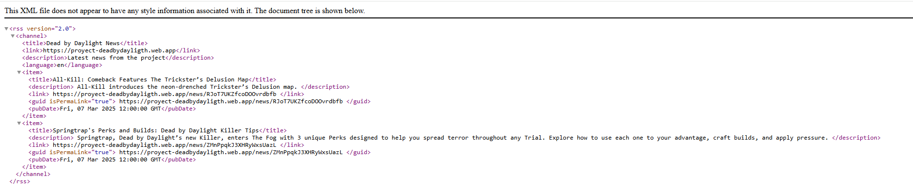

# Dead by Daylight Web App

A **React** web application showcasing the world of *Dead by Daylight*, displaying **characters, killers, survivors**, and **game-related news**. The website supports **multi-language** (EN/ES) and follows a **Figma design prototype**.

---
🔗 **Repository:**  
https://github.com/Ixf2/Prototipe-DeadByDaylight

*** Firebase Hosting
Project online:
https://proyect-deadbydayligth.web.app

---

## 📌 Features

- **Home Page**  
 The Home page acts as the main entry point of the application. It provides users with an overview of the Dead by Daylight universe and highlights recent content and updates related to the game.

At the top of the page, the Header component is displayed, which contains the main navigation menu that allows users to access different sections of the website such as Killers, Survivors, Maps, and other pages. Below the header, the page briefly shows a LoadingScreen component, which simulates a game-style loading experience inspired by Dead by Daylight. This loading screen displays the game logo, animated fog effects, and a progress bar to create a more immersive visual effect.

The central section of the page contains the main content wrapped inside the <main> element. The first element shown is a welcome title, which is translated dynamically using the react-i18next library. This allows the page to display text in either Spanish or English depending on the selected language.

Under the title, there are language selection buttons that allow users to switch between Spanish and English. These buttons trigger the changeLanguage function, which updates the language configuration through i18next and automatically updates all translated texts on the page.

The Home page also contains a news toggle button that allows users to show or hide the news section. This functionality is controlled using React’s useState hook, which stores whether the news section should be visible or not.

Below this control area, the page displays two highlighted featured articles related to Dead by Daylight content. Each article includes a title, an image, and a short description. The titles and descriptions are also translated using i18next to support both languages.

Finally, the Home page includes the HomeNews component, which loads additional news dynamically from a Firebase Firestore database. These news items are retrieved using asynchronous functions and displayed in a grid layout. Each news card includes an image, category label, title, and description of the article.

At the bottom of the page, the Footer component is displayed, providing additional links, social media icons, and access to the RSS feed of the project.

Overall, the Home page combines static content, dynamic data from Firebase, and multilingual support to provide users with an informative and interactive introduction to the web application.

- **Killers Section**  
  Showcases killers with cards containing name, image, and description.

- **Survivors Section**  
  Will follow the same structure as the Killers section.

- **Multilanguage Support**  
  Switch between English and Spanish using `react-i18next`.

- **Reusable Components**
  - Header
  - Footer
  - Card component for character information
  - Loading Screen

- **Dynamic State Management**
  - useState
  - useEffect
  - Conditional rendering
  - Filter

- **Responsive Design**  
  - Flexbox layouts
  - Sticky cinematic header
  - Mobile navigation menu

## 🔥 Firebase Hosting

The application is deployed using **Firebase Hosting**.

🌐 Live Website:  
https://proyect-deadbydayligth.web.app

Deployment process:

```bash
npm run build
firebase deploy --only hosting
```

The production files are generated int the dist folder and then uploaded to Firebase Hosting.


---

# 2️⃣ Añadir RSS Feed

Justo **debajo de Firebase Hosting**.

```markdown
## 📡 RSS Feed

The project includes an **RSS feed** that provides the latest news from the application.

🔗 RSS Feed:  
https://proyect-deadbydayligth.web.app/rss/News.xml

Each RSS item links directly to a news article within the website.

Example RSS structure:

```xml
<item>
<title>All-Kill: Comeback Features The Trickster’s Delusion Map</title>
<link>https://proyect-deadbydayligth.web.app/news/RJoT7UKZfcoDOOvrdbfb</link>
<guid>https://proyect-deadbydayligth.web.app/news/RJoT7UKZfcoDOOvrdbfb</guid>
<pubDate>Fri, 07 Mar 2025 12:00:00 GMT</pubDate>
</item>
```
The RSS feed is accessible from the website footer through an RSS icon.


---

## 📸 Screenshots
### Home Page


### Killers Page


### Survivors Page


### Map


### LoadingScreen


### RSS Feed Reader Example




---

## 📂 Project Structure
├── public <br>
├── src <br>
│   ├── components <br>
│   │   ├── card <br>
│   │   ├── footer <br> 
│   │   ├── form <br>
│   │   ├── header <br>
│   │   ├── navbar <br>
│   │   └── loading <br>
│   ├── data <br>
│   │   ├── design_web <br>
│   │   ├── images <br>
│   │   │   ├── characters-killers <br>
│   │   │   └── charactert-survivors <br>
│   │   └── json <br>
│   ├── i18n <br>
│   └── pages <br>
│       ├── Home <br>
│       ├── killers <br>
│       ├── legal <br>
│       ├── maps <br>
│       └── survivors <br>
├── node_modules <br>
└── package.json <br>

---

### Folder Description

- `components/` → Reusable UI components
- `data/images/` → Character images
- `data/json/` → Character information
- `i18n/` → Language configuration files
- `pages/` → Main application pages

---

## ⚙️ Installation and Running

### 1️⃣ Clone the repository

```bash
git clone https://github.com/Ixf2/Prototipe-DeadByDaylight
cd Prototipe-DeadByDaylight/
```

### 2️⃣ Clone the repository
```bash
npm install
```

### 3️⃣ Run the project
```bash
npm run dev
```

### 4️⃣ Open the application in your browser
```bash
http://localhost:5173
```

### 🌐 Multilanguage Support

This project uses i18next for translations.
*Example*
```
const { t, i18n } = useTranslation();

const changeLanguage = (lng) => {
  i18n.changeLanguage(lng);
};
```
*Language Buttons*
```
<button onClick={() => changeLanguage('es')}>🇪🇸 ES</button>
<button onClick={() => changeLanguage('en')}>🇺🇸 EN</button>
```

---

### ⚠️ Known Issue - ESLint Dependency Conflict
This project may present a dependency conclit between "eslint" and "eslint-plugin-react-hooks". If you are using ESLint v10, installation may fail with an ERESOLVE error because "eslint-plugin-react-hooks" currently supports up to ESLint v9.
  - **Recommended Solution**
  ```bash
      rm -rf node_modules packege-lock.json
  ```

   - **Then update packege.json**
  ```bash
  "devDependencies": {
  "eslint": "^9.39.3"
  }
  ```

  - **Reinstall dependencies**
    ```bash
    npm install
    ```

  - **ALTERNATIVE (NOT RECOMMENDED)**
  Force installation ignoring peer dependency conflicts
  ```bash
  npm install --legacy-peer-deps
  ```
---

### 🖼️ References and Resources
- **Official Dead by Daylight Website**

  - https://deadbydaylight.com/game/collections/

  - https://deadbydaylight.com/game/characters/

  - https://deadbydaylight.com/game/characters/vittorio-toscano/

  - https://deadbydaylight.com/game/maps/

- **Figma Design Prototype**

https://www.figma.com/design/x1uXyHXhOGhqXl0zr0RmNz/Design-Web-DBD


### Documentation Used
- **REACT**
  - https://react.dev/
  - https://react.dev/reference/react/useState
  - https://react.dev/reference/react/useEffect

- **REACT Router**
  - https://reactrouter.com/en/main
  - https://reactrouter.com/api/hooks/useLocation
  - https://www.w3schools.com/react/react_router.asp

- **WOUTER  (Routing Alternative Reference)**
  - https://github.com/molefrog/wouter

- **i18next**
  - https://www.i18next.com
  - https://react.i18next.com


- **Firebase Hosting**
  - https://firebase.google.com/docs/hosting
  - https://firebase.google.com/docs

- **Firebase Firestore**
  - https://firebase.google.com/docs/firestore

- **RSS 2.0 Specification**
  - https://www.rssboard.org/rss-specification

- **MDN Web Docs (JavaScript / CSS)**
  - https://developer.mozilla.org/es/


### CSS References
- **OKLCH / LHC Colours**
  - https://lenguajecss.com/css/colores/funcion-lch/
  - https://developer.mozilla.org/en-US/docs/Web/CSS/Reference/Values/color_value/oklch

- **Animation**
  - https://developer.mozilla.org/en-US/docs/Web/CSS/Reference/At-rules/@keyframes
  - https://developer.mozilla.org/en-US/docs/Web/CSS/Reference/Properties/animation

- **Backdrop Filter**
  - https://developer.mozilla.org/en-US/docs/Web/CSS/Reference/Properties/backdrop-filter

- **Flexbox**
  - https://developer.mozilla.org/en-US/docs/Web/CSS/Guides/Flexible_box_layout/Basic_concepts

- **General Web Documentation**
  - https://developer.mozilla.org/es/

### 💻 Technologies
- React 18+

- React Router DOM

- react-i18next

- Vite

- CSS3

- OKLCH Colours System

- Firebase Hosting

- Firebase Firestore

---


