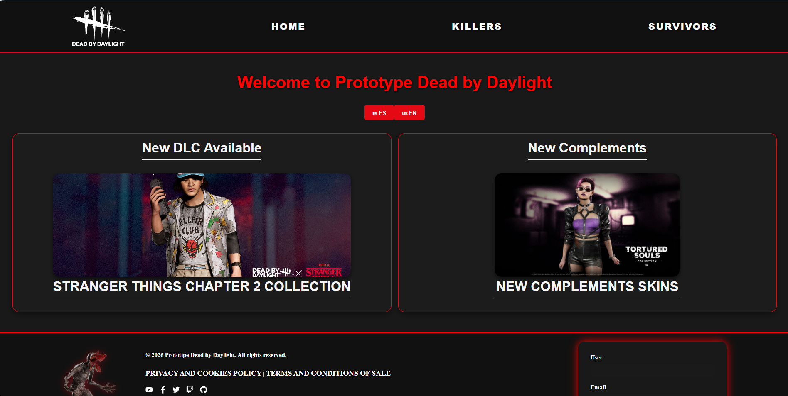
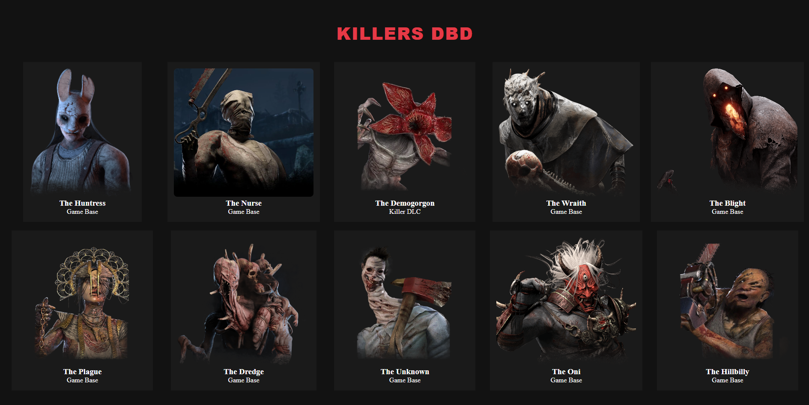
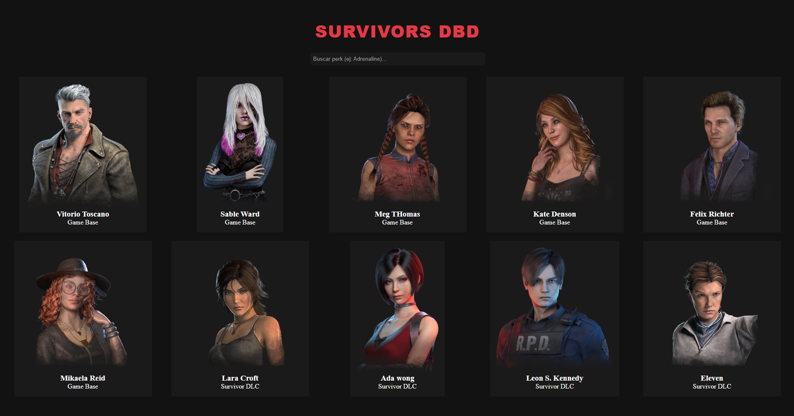
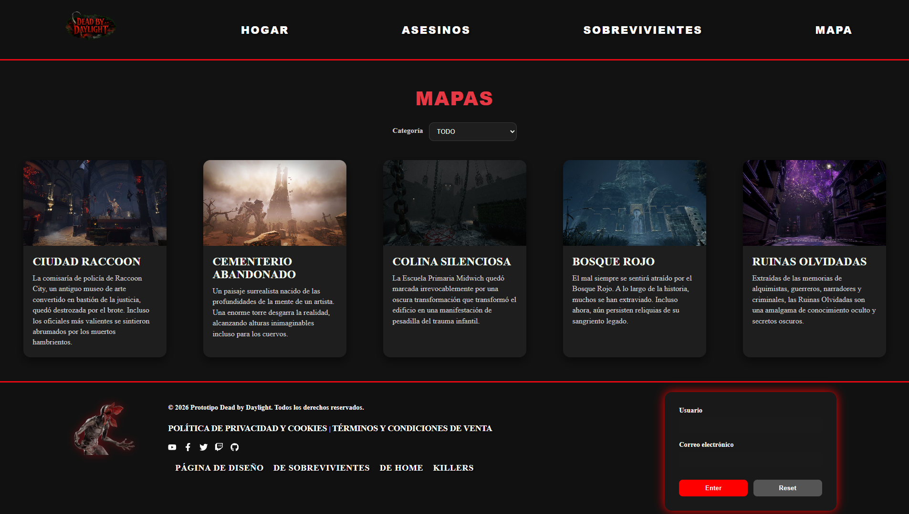
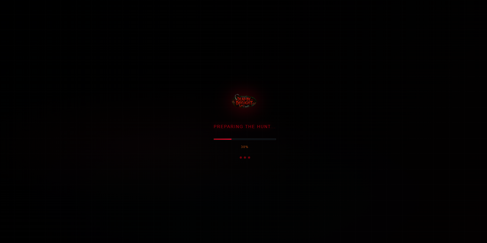

# Dead by Daylight Web App

A **React** web application showcasing the world of *Dead by Daylight*, displaying **characters, killers, survivors**, and **game-related news**. The website supports **multilanguage** (EN/ES) and follows a **Figma design prototype**.

---
🔗 **Repository:**  
https://github.com/Ixf2/Prototipe-DeadByDaylight
---
## 📸 Screenshots
### Home Page


### Killers Page


### Survivors Page


### Map


### LoadingScreen



## 📌 Features

- **Home Page**  
  Displays news and articles about DLCs and game updates, including images and descriptions.

- **Killers Section**  
  Showcases killers with cards containing name, image, and description.

- **Survivors Section** *(Coming Soon)*  
  Will follow the same structure as the Killers section.

- **Multilanguage Support**  
  Switch between English and Spanish using `react-i18next`.

- **Reusable Components**
  - Header
  - Footer
  - Card component for character information
  - Loading Screen

- **Dynamic State Management**
  - useState
  - useEffect
  - Conditional rendering
  - Filter

- **Responsive Design**  
  - Flexbox layouts
  - Sticky cinematic header
  - Mobile navigation menu
- **

---

## 📂 Project Structure
├── public <br>
├── src <br>
│   ├── components <br>
│   │   ├── card <br>
│   │   ├── footer <br> 
│   │   ├── form <br>
│   │   ├── header <br>
│   │   ├── navbar <br>
│   │   └── loading <br>
│   ├── data <br>
│   │   ├── design_web <br>
│   │   ├── images <br>
│   │   │   ├── characters-killers <br>
│   │   │   └── charactert-survivors <br>
│   │   └── json <br>
│   ├── i18n <br>
│   └── pages <br>
│       ├── Home <br>
│       ├── killers <br>
│       ├── legal <br>
│       ├── maps <br>
│       └── survivors <br>
├── node_modules <br>
└── package.json <br>

---
### Folder Description

- `components/` → Reusable UI components
- `data/images/` → Character images
- `data/json/` → Character information
- `i18n/` → Language configuration files
- `pages/` → Main application pages

---

## ⚙️ Installation and Running

### 1️⃣ Clone the repository

```bash
git clone <REPOSITORY_URL>
cd project-name
```

### 2️⃣ Clone the repository
```bash
npm install
```

### 3️⃣ Run the project
```bash
npm run dev
```

### 4️⃣ Open in browser
```bash
http://localhost:5173
```

### 🌐 Multilanguage Support

This project uses i18next for translations.
*Example*
```
const { t, i18n } = useTranslation();

const changeLanguage = (lng) => {
  i18n.changeLanguage(lng);
};
```
*Language Buttons*
```
<button onClick={() => changeLanguage('es')}>🇪🇸 ES</button>
<button onClick={() => changeLanguage('en')}>🇺🇸 EN</button>
```

### 🖼️ References and Resources
- Official Dead by Daylight Website

https://deadbydaylight.com/game/collections/

https://deadbydaylight.com/game/characters/

https://deadbydaylight.com/game/characters/vittorio-toscano/

https://deadbydaylight.com/game/maps/

- Figma Design Prototype

https://www.figma.com/design/x1uXyHXhOGhqXl0zr0RmNz/Design-Web-DBD

### Documentation Used
- **REACT**
  - https://react.dev/
  - https://react.dev/reference/react/useState
  - https://react.dev/reference/react/useEffect

- **REACT Router**
  - https://reactrouter.com/en/main
  - https://reactrouter.com/api/hooks/useLocation
  - https://www.w3schools.com/react/react_router.asp

- **WOUTER  (Routing Alternative Reference)**
  - https://github.com/molefrog/wouter

- **i18next**
  - https://www.i18next.com
  - https://react.i18next.com

### CSS References
- **OKLCH / LHC Colours**
  - https://lenguajecss.com/css/colores/funcion-lch/
  - https://developer.mozilla.org/en-US/docs/Web/CSS/Reference/Values/color_value/oklch

- **Animation**
  - https://developer.mozilla.org/en-US/docs/Web/CSS/Reference/At-rules/@keyframes
  - https://developer.mozilla.org/en-US/docs/Web/CSS/Reference/Properties/animation

- **Backdrop Filter**
  - https://developer.mozilla.org/en-US/docs/Web/CSS/Reference/Properties/backdrop-filter

- **Flexbox**
  - https://developer.mozilla.org/en-US/docs/Web/CSS/Guides/Flexible_box_layout/Basic_concepts


### 💻 Technologies
- React 18+

- React Router DOM

- react-i18next

- Vite

- CSS3

- OKLCH Colours System


---


